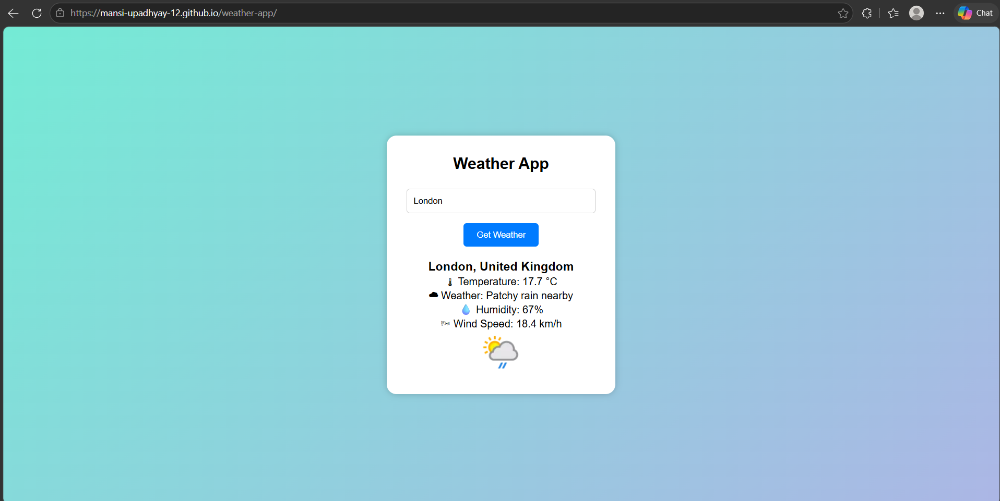

# 🌦️ Weather App

A simple weather application built using **HTML, CSS, and JavaScript**.

## 📖 About
This project was created to learn **API integration** and understand how real-world applications fetch and display live weather data. It uses **WeatherAPI** to provide current weather information for any city.

## ✨ Features
- Search weather by city
- Real-time weather updates
- Temperature, humidity, and wind speed
- Weather condition icons

## 🛠️ Technologies Used
- HTML
- CSS
- JavaScript
- WeatherAPI

## 🌐 API Used
Weather data is fetched using the WeatherAPI service.

## 🎯 Learning Outcomes
- Working with APIs
- Using Fetch API and async JavaScript
- Handling JSON data
- DOM manipulation
- Building real-world frontend projects
- Deploying projects with GitHub Pages

## 📸 Screenshots

## 🔗 Live Demo
👉 [View Weather App](https://mansi-upadhyay-12.github.io/weather-app/)

## 👩‍💻 Author
**Mansi Upadhyay**
